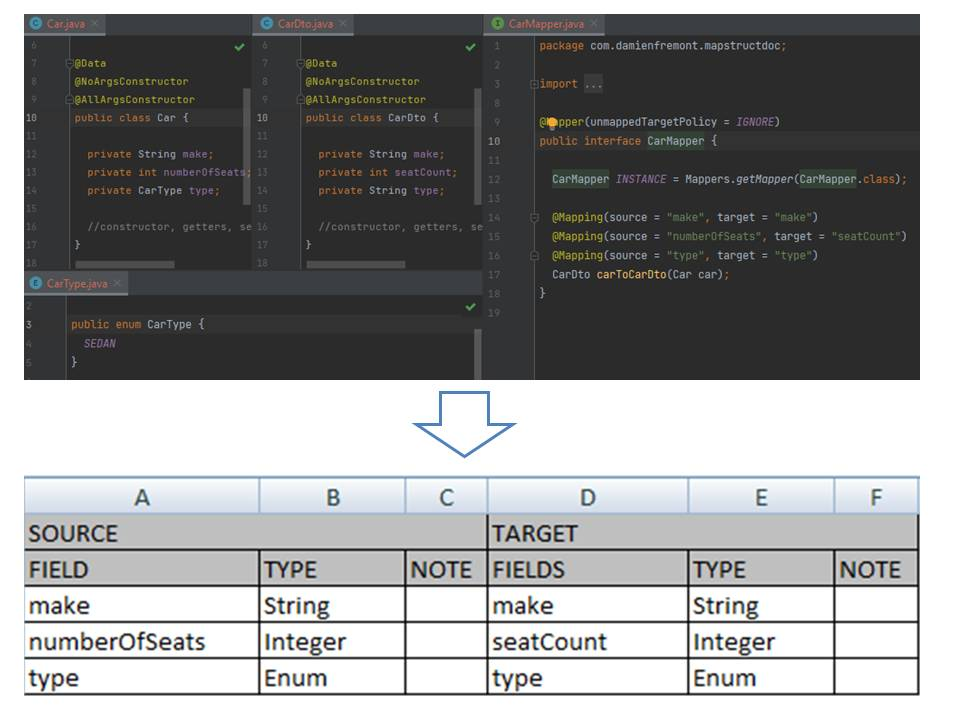

# MapStruct Doc - Maven Plugin

[](https://search.maven.org/search?q=g:org.mapstruct%20AND%20v:1.*.Final)
[](https://github.com/mapstruct/mapstruct/blob/main/LICENSE.txt)
[](https://twitter.com/intent/follow?screen_name=Damien_Fremont)

:warning: **WORK IN PROGRESS !!!**

Liked some of my work? Buy me a coffee (or more likely a beer)

<a href="https://www.buymeacoffee.com/damienfremont" target="_blank"></a>

* [What is MapStruct Doc?](#what-is-mapstruct-doc)
* [Requirements](#requirements)
* [Using MapStruct Doc](#using-mapstruct-doc)
    * [Maven](#maven)
* [Documentation and getting help](#documentation-and-getting-help)
* [Licensing](#licensing)
* [links](#links)

---

## What is MapStruct Doc?

MapStruct Doc is a
Java [annotation processor](https://docs.oracle.com/javase/6/docs/technotes/guides/apt/index.html)
for the generation of documentation for mapping interface (CSV, Markdown or
AsciiDoc).



At compile time MapStruct will generate a file for each interface.

## Requirements

MapStruct Doc requires Java 1.8 or later.

## Using MapStruct Doc

### Maven

For Maven-based projects, add the following to your POM file in order to use
MapStruct Doc:

```xml
<project>
  ...
  <properties>
    <mapstruct-doc.version>1.5.5-SNAPSHOT</mapstruct-doc.version>
  </properties>
  ...
  <build>
    <plugins>
      ...
      <plugin>
        <groupId>com.damienfremont.mapstruct</groupId>
        <artifactId>mapstruct-doc-maven-plugin</artifactId>
        <version>${mapstruct-doc.version}</version>
        <configuration>
          <include>com.damienfremont.mapstruct.CarMapper</include>
        </configuration>
        <executions>
          <execution>
            <goals>
              <goal>generate</goal>
            </goals>
            <phase>install</phase>
          </execution>
        </executions>
      </plugin>
    </plugins>
  </build>
</project>
```

And execute any of the following commands:

```bash
mvn install -DskipTests
```

```bash
mvn com.damienfremont.mapstruct:mapstruct-doc-maven-plugin:1.5.5-SNAPSHOT:generate
```

## Documentation and getting help

|      Feature       | State | Note |
|:------------------:|------:|-----:|
| maven              |   :heavy_check_mark: |      |
| scan-javadoc       |   :x: |      |
| generate-csv       |   :x: |      |
| generate-text      |   :x: |      |
| generate-markdown  |   :x: |      |
| generate-html      |   :x: |      |
| generate-asciidoc  |   :x: |      |
| maven-site         |   :x: |      |
| gradle             |   :x: |      |

## Licensing

[MIT License](https://opensource.org/license/mit/)

## Contributing

Want to contribute ? Please contact
the [authors](mailto:damien.fremont@gmail.com).


## Links

- mapstruct.org
    - [ide-support](https://mapstruct.org/documentation/ide-support/)
- stackoverflow.com
    - ["Generate documentation from Mapstruct code ?"](https://stackoverflow.com/questions/74796733/generate-documentation-from-mapstruct-code)
- other
    - [maven-plugin (README layout)](https://docs.spring.io/spring-boot/docs/current/maven-plugin/reference/htmlsingle/)
    - [mojo-executor (project layout)](https://github.com/mojo-executor/mojo-executor)
    - [maven-compiler (tests layout)](https://github.com/apache/maven-compiler-plugin)
    - [enunciate (gradle plugin)](https://github.com/stoicflame/enunciate-gradle)
- hannesdorfmann.com
    - [Annotation Processing 101: post](http://hannesdorfmann.com/annotation-processing/annotationprocessing101/)
    - [Annotation Processing 101: github](https://github.com/sockeqwe/annotationprocessing101)
- baeldung.com
    - [Java Annotation Processing and Creating a Builder](https://www.baeldung.com/java-annotation-processing-builder)
